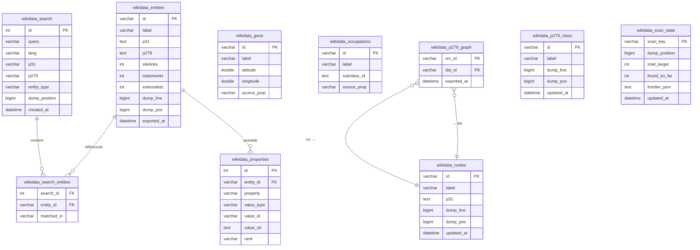
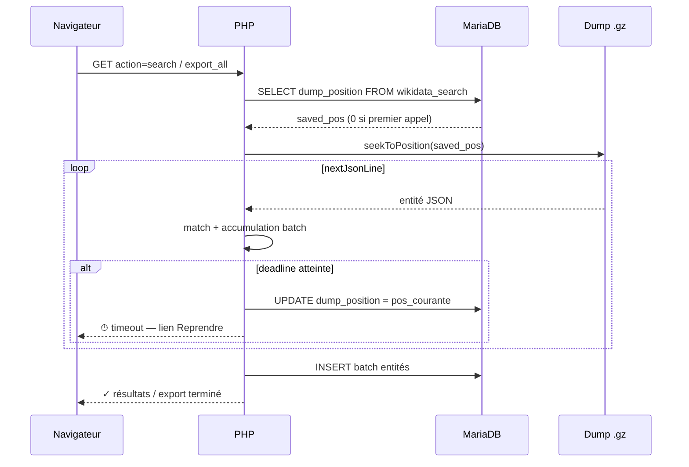
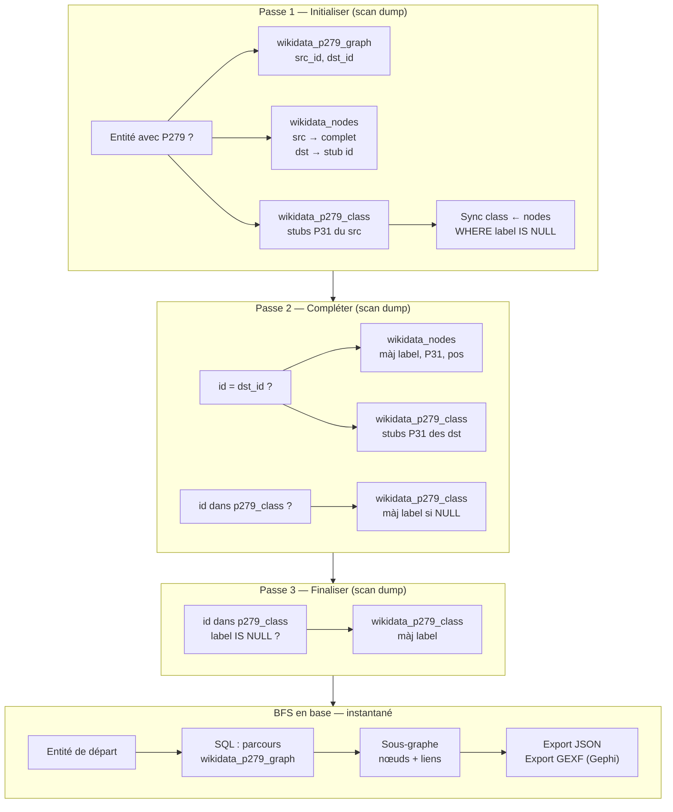

# monWikidata — Explorateur de dump Wikidata

Application PHP pour explorer le dump JSON compressé de Wikidata (`wikidata-20240101-all.json.gz`) via une interface web avec stockage MariaDB. Chaque scan du dump (~100 Go) est interruptible et repris automatiquement après timeout.

---

## Prérequis

- PHP 8.3+ (`/opt/homebrew/bin/php`)
- MariaDB / MySQL
- Composer
- Dump Wikidata : `wikidata-20240101-all.json.gz` à la racine

## Installation

```bash
composer install
cp config.example.php config.php   # éditer host, port, dbname, user, pass
```

---

## Architecture

```mermaid
graph LR
    B([Navigateur])
    P[exploreDump.php<br/>PHP 8.3]
    DB[(MariaDB<br/>wikidata)]
    R[GzDumpReader<br/>seekToPosition]
    D[("Dump .json.gz<br/>~100 Go")]

    B -->|HTTP GET/POST| P
    P -->|HTML / CSV / JSON / GEXF| B
    P <-->|INSERT / SELECT| DB
    DB -.->|saved_pos| P
    P -->|seekToPosition(pos)| R
    R -->|nextJsonLine()| D
```

> La flèche pointillée `saved_pos` représente le mécanisme de reprise : la position byte dans le dump est sauvegardée dans `wikidata_scan_state` au moment du timeout et relue à la requête suivante.

---

## Base de données



---

## Onglets

### Recherche

Recherche full-text + filtres (P31, P279, type d'entité, identifiant exact, plage de lignes) dans le dump. Résultats exportables en CSV ou envoyés directement en base.

**Reprise automatique après timeout :**



### Entités (`wikidata_entities`)

Entités exportées depuis les recherches : label, description, P31, P279, Wikipedia, sitelinks, statements, identifiants externes, position dans le dump.

### Propriétés (`wikidata_properties`)

Scan du dump pour extraire les valeurs d'une propriété donnée (ex. P569 date de naissance) pour les entités déjà en base.

### Géos (`wikidata_geos`)

Extraction des coordonnées P625 pour les entités référencées par P19 (lieu de naissance). Résumable après timeout.

### Occupations (`wikidata_occupations`)

Extraction des entités référencées par P106 (occupation) avec leur hiérarchie `subclass_of` (P279 pipe-séparés).

---

## Réseau P279 — workflow en 3 passes



**Arborescence des classes (SQL récursif) :**

```sql
WITH RECURSIVE class_tree AS (
    SELECT c.id, c.label, 0 AS depth,
           CAST(CONCAT(c.id,' (',COALESCE(c.label,'?'),')') AS CHAR(10000)) AS path
    FROM wikidata_nodes n
    JOIN wikidata_p279_class c
      ON FIND_IN_SET(c.id, REPLACE(n.p31,'|',',')) > 0
    WHERE n.id = 'Q28640'
    UNION ALL
    SELECT g.dst_id, cls.label, ct.depth + 1,
           CONCAT(g.dst_id,' (',COALESCE(cls.label,'?'),') > ',ct.path)
    FROM class_tree ct
    JOIN wikidata_p279_graph g ON g.src_id = ct.id
    LEFT JOIN wikidata_p279_class cls ON cls.id = g.dst_id
    WHERE ct.depth < 20
)
SELECT id, label, depth, path FROM class_tree ORDER BY path;
```

---

## Exports

| Format | Onglet        | Contenu                                      |
|--------|---------------|----------------------------------------------|
| CSV    | Entités       | id, label, description, P31, P279, Wikipedia |
| CSV    | Propriétés    | property, value_type, value_id, value_str    |
| CSV    | Géos          | id, label, latitude, longitude               |
| CSV    | Occupations   | id, label, subclass_of                       |
| JSON   | Réseau P279   | `{ nodes: [{id,label,p31}], links: [{idSrc,idDst}] }` |
| GEXF   | Réseau P279   | Format Gephi — attribut `p31` sur les nœuds  |

---

## Constantes

| Constante    | Valeur        | Description                              |
|--------------|---------------|------------------------------------------|
| `TIME_LIMIT` | 10 800 s (3h) | Limite PHP par requête HTTP              |
| `MAX_RESULTS`| 200           | Résultats max par recherche              |
| `DUMP_FILE`  | `wikidata-20240101-all.json.gz` | Chemin du dump       |
| `PREF_LANG`  | `['fr','en']` | Langues préférées pour les labels        |

---

## Gestion du timeout

Toutes les fonctions de scan partagent le même pattern :

```php
$deadline = (int)$_SERVER['REQUEST_TIME'] + TIME_LIMIT - 5;
// ...
if (time() >= $deadline) { $timedOut = true; break; }
// ...
if ($timedOut) {
    saveScanState($key, $reader->getPosition(), $total, $found);
} else {
    clearScanState($key);
}
```

Le `deadline` est calculé depuis `REQUEST_TIME` (heure de début de la requête HTTP) pour rester aligné avec `set_time_limit()`. Les 5 secondes de marge laissent le temps au flush final en base.

---

## Licence

Données Wikidata sous licence [CC0](https://creativecommons.org/publicdomain/zero/1.0/). Code sous [MIT](LICENSE).
